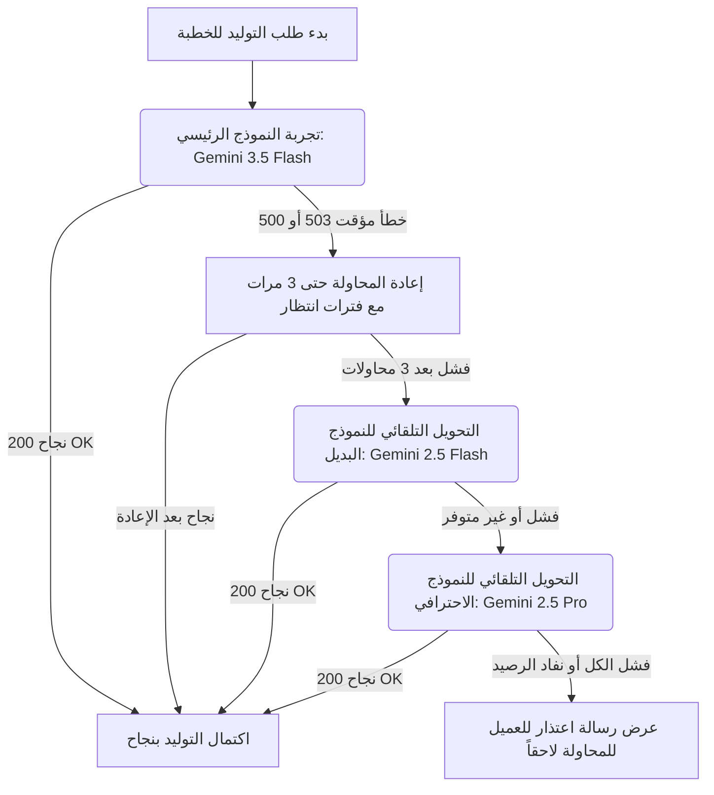

# تقرير تحليل آلية التوليد وحساب الميزانية (Sermon Generation & Cost Analysis)

يوضح هذا المستند آلية عمل نظام توليد الخطب بالتفصيل، والفرق بين النماذج المجانية والمدفوعة، وحسابات التكلفة المتوقعة لكل خطبة لتمكينك من وضع الميزانية المناسبة لمشروعك.

---

## ١. آلية التوليد والسيناريوهات (Generation Workflow)

تتم عملية التوليد على مستويين متوازيين لضمان أقصى سرعة ممكنة (تستغرق العملية عادةً من 15 إلى 30 ثانية للخطبة الكاملة):

### هيكل طلبات الخطبة الواحدة (لخطبة مدتها 20 دقيقة):
1. **طلب توليد العنوان (طلب واحد):** يحلل الموضوع ويقترح عنواناً جذاباً.
2. **طلب توليد الأقسام بالتوازي (6 طلبات منفصلة):**
   * المقدمة (Intro)
   * المحور الأول (Axis 1)
   * المحور الثاني (Axis 2)
   * المحور الثالث (Axis 3)
   * الخاتمة (Closing)
   * الدعاء (Prayer)
* **إجمالي عدد الطلبات للخطبة الواحدة = 7 طلبات API متزامنة.**

---

### سيناريوهات التنفيذ وحالات الفشل (Scenarios & Failover)

عند نقر العميل على "توليد"، يتبع النظام المسار التالي تلقائياً:

---

## ٢. مقارنة الحسابات: المجاني (Free Tier) ضد المدفوع (Pay-As-You-Go)

| الميزة | الحساب المجاني (Free API Key) | الحساب المدفوع (Billing Enabled) |
| :--- | :--- | :--- |
| **التكلفة** | $0.00 (مجاني تماماً) | الدفع بحسب الاستخدام (بالمليون توكن) |
| **حد الطلبات في الدقيقة (RPM)** | منخفض جداً (عادة 2 إلى 15 طلب في الدقيقة) | مرتفع جداً (من 360 إلى 1000+ طلب في الدقيقة) |
| **معدل استقرار الخدمة** | متوسط (يتأثر بضغط خوادم جوجل العامة ويسبب خطأ 503) | ممتاز 99.9% (خوادم مخصصة ومستقرة تماماً) |
| **سلوك النظام** | قمنا بتدعيم الكود ليعيد المحاولة وينتظر لحل مشاكله | يعمل بسلاسة فائقة وسرعة قصوى دون أي أخطاء |

> [!TIP]
> **نصيحة التشغيل:** إذا كان لديك عدد عملاء قليل، يمكنك الاستمرار بالحساب المجاني مع التعديلات الجديدة التي أضفناها (النظام سيتعامل مع الـ 503 ذاتياً). أما إذا دخل المشروع مرحلة الإنتاج التجاري الفعلي مع أعداد عملاء كبيرة، فيُوصى بشدة بتفعيل **الدفع بحسب الاستخدام** لضمان استقرار 100%.

---

## ٣. حساب تكلفة الخطبة والكلمة (Cost & Budgeting)

لحساب التكاليف بدقة، نعتمد على المعدل المتوسط للغة العربية حيث **كل 1 كلمة عربية تعادل حوالي 1.4 توكن (Tokens)**.

### مواصفات الخطبة المتوسطة (مدة 20 دقيقة):
* عدد الكلمات المولّدة: **2,200 كلمة عربية**.
* إجمالي توكن المدخلات (Prompts + Context): **10,500 توكن**.
* إجمالي توكن المخرجات (Sermon Text): **3,100 توكن**.

---

### جدول تكاليف النماذج (بالدولار الأمريكي):

| النموذج المستخدم | تكلفة المدخلات (لكل 1M توكن) | تكلفة المخرجات (لكل 1M توكن) | تكلفة توليد الخطبة الواحدة (2200 كلمة) | تكلفة الكلمة الواحدة | كم خطبة تحصل عليها بـ $10؟ |
| :--- | :--- | :--- | :--- | :--- | :--- |
| **Gemini 2.5 Flash** *(الأوفر)* | $0.30 | $2.50 | **$0.0109** (حوالي 1 سنت) | $0.000005 | **917 خطبة** |
| **Gemini 3.5 Flash** *(الرئيسي)* | $1.50 | $9.00 | **$0.0436** (حوالي 4.3 سنت) | $0.000020 | **229 خطبة** |
| **Gemini 2.5 Pro** *(الأعلى جودة)* | $1.25 | $10.00 | **$0.0441** (حوالي 4.4 سنت) | $0.000020 | **226 خطبة** |

---

## ٤. مقترح ميزانية التشغيل (Suggested Budget)

إذا افترضنا أنك تستخدم النموذج الرئيسي **Gemini 3.5 Flash** على الحساب المدفوع:

* **ميزانية بقيمة $10 شهرياً:** تتيح لعملائك توليد حوالي **230 خطبة كاملة** شهرياً.
* **ميزانية بقيمة $50 شهرياً:** تتيح لعملائك توليد حوالي **1,150 خطبة كاملة** شهرياً.
* **ميزانية بقيمة $100 شهرياً:** تتيح لعملائك توليد حوالي **2,300 خطبة كاملة** شهرياً.

> [!NOTE]
> لا يتم احتساب أي مبالغ إضافية عند فشل الطلبات، ويتم الخصم فقط على التوكنز التي تمت معالجتها وإرجاعها بنجاح.
